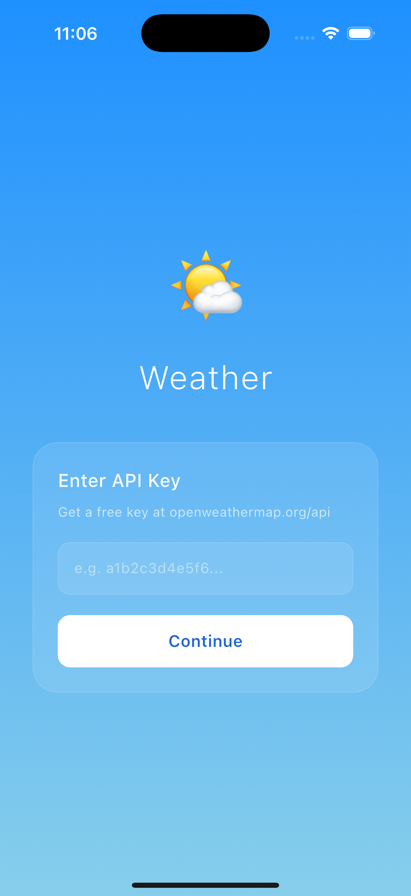
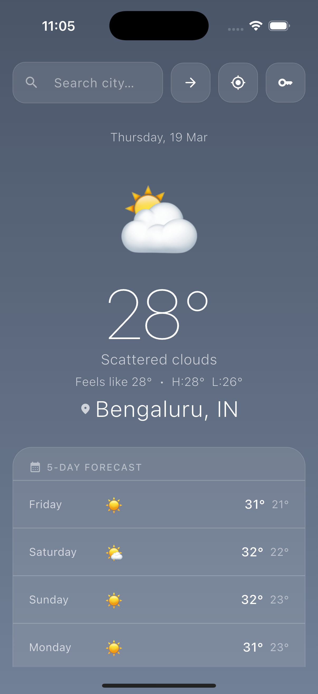

# 🌦️ Weather App

A polished, location-aware weather app built with **Flutter**, powered by **BLoC/Cubit** for state management and structured with **Clean Architecture** principles. Get real-time weather and a 5-day forecast for any city or your current location.

---

## 📱 App Screens

<p align="center">
  
  
</p>

---

## 🔑 Getting Your API Key

This app uses the **OpenWeatherMap** free API.

1. Go to [openweathermap.org](https://openweathermap.org/) and create a free account
2. Navigate to **API Keys** in your dashboard
3. Copy the default key (or create a new one)
4. Launch the app — paste the key on the first screen and tap **Continue**

> ✅ The key is stored locally via `SharedPreferences`. Tap the 🔑 icon on the main screen anytime to update it.

> ⚠️ Newly created keys can take **up to 2 hours** to activate. If you get an error right after registering, wait and try again.

---

## 🚀 Features

* 📍 Location-based weather using device GPS
* 🔍 Search any city worldwide
* 🌡️ Current temperature, feels like, high / low
* 🌤️ Weather condition with dynamic emoji
* 📅 5-day forecast with rain probability
* 💧 Humidity, wind speed & direction, visibility
* 🌅 Sunrise and sunset times
* 🎨 Animated gradient background — changes based on condition and day/night
* 🔄 Pull-to-refresh
* 🕓 Last searched city remembered on next launch
* 🔑 Runtime API key entry — no rebuild needed
* ⚠️ Full error states with retry

---

## 🏗️ Architecture

This project follows **Clean Architecture** with a feature-based folder structure:

```
lib/
 ├── core/
 │   ├── theme/              # Gradient palettes, text styles, app theme
 │   ├── utils/              # API constants, weather condition helper
 │   └── error/              # Failure types (Server, Network, Location...)
 ├── features/
 │   └── weather/
 │       ├── data/
 │       │   ├── models/         # CurrentWeatherModel, ForecastModel
 │       │   ├── datasources/    # WeatherRemoteDataSource (Dio)
 │       │   │                   # LocationDataSource (Geolocator)
 │       │   └── repositories/   # WeatherRepositoryImpl
 │       ├── domain/
 │       │   ├── entities/       # CurrentWeather, ForecastDay
 │       │   ├── repositories/   # WeatherRepository (abstract)
 │       │   └── usecases/       # 4 use cases (by location / by city)
 │       └── presentation/
 │           ├── cubit/          # WeatherCubit, WeatherState
 │           ├── pages/          # WeatherPage, ApiKeyScreen
 │           └── widgets/        # CurrentWeatherCard, ForecastList
 │                               # WeatherDetailGrid, WeatherSearchBar
 │                               # WeatherStateWidgets (loading/error/initial)
 ├── injection_container.dart    # GetIt DI wiring
 └── main.dart
```

### 🔁 State Management

* Uses **flutter_bloc** (`Cubit`) for clean, testable state handling
* `WeatherState` has 4 states: `Initial`, `Loading`, `Loaded`, `Error`
* `WeatherCubit` exposes `loadByLocation()`, `loadByCity()`, `loadLastCity()`
* Last searched city persisted in `SharedPreferences` and restored on launch

---

## 🎨 UI Highlights

* 🌈 Smooth animated gradient background — transitions between 7 sky palettes based on weather condition and day/night flag
* 🌤️ Large weather emoji representing current condition
* 📜 `DraggableScrollableSheet` for history (drag to expand/collapse)
* 🔝 Search bar at top with GPS and arrow buttons
* 📋 5-day forecast with rain % shown when > 20%
* 🟦 Frosted-glass detail grid for humidity, wind, visibility, sunrise/sunset

---

## 🌦️ Weather Gradients

| Condition | Gradient |
|---|---|
| Clear (Day) | Sky blue → Light blue |
| Clear (Night) | Midnight → Dark navy |
| Cloudy | Slate → Grey |
| Rainy | Dark slate → Medium slate |
| Stormy | Near-black → Very dark |
| Snowy | Powder blue → Ice white |
| Foggy | Medium grey → Light grey |

---

## 🧪 Tech Stack

| Layer | Technology |
|---|---|
| UI Framework | Flutter |
| Language | Dart |
| State | BLoC / Cubit |
| Networking | Dio |
| Location | Geolocator |
| Persistence | SharedPreferences |
| DI | GetIt |
| Architecture | Clean Architecture |
| API | OpenWeatherMap (free) |

---

## 📦 Dependencies

```yaml
flutter_bloc: ^8.1.6
equatable: ^2.0.5
dio: ^5.4.3+1
geolocator: ^13.0.2
geocoding: ^3.0.0
shared_preferences: ^2.3.2
intl: ^0.19.0
get_it: ^7.7.0
dartz: ^0.10.1
```

---

## 🚀 Getting Started

```bash
git clone <repo-url>
cd weather_app
flutter pub get
flutter run
```

On first launch, enter your OpenWeatherMap API key (see [Getting Your API Key](#-getting-your-api-key) above).

---

## 📡 API Endpoints Used

| Endpoint | Purpose |
|---|---|
| `/weather` | Current weather by city or coords |
| `/forecast` | 5-day / 3-hour forecast |

---

## 🤝 Contributing

Contributions are welcome! Feel free to fork this repo and submit a PR.

---

## 📄 License

This project is licensed under the MIT License.
